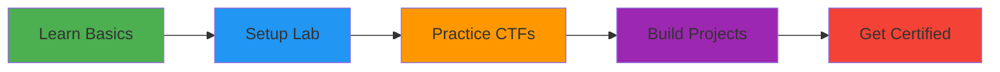

<div align="center">

# 🛡️ Cybersecurity Journey | Blue Team Focus


[](https://github.com/Nimashia200)


---

### 🎓 Cybersecurity Student | 🔵 Blue Team Enthusiast | 🇱🇰 Sri Lanka

</div>

---

## 🚀 About Me
```python
class CyberSecurityStudent:
    def __init__(self):
        self.name = "Nimashia"
        self.role = "Defensive Security Learner"
        self.focus = ["Blue Team", "SOC Analysis", "Threat Detection"]
        self.location = "Sri Lanka 🇱🇰"
        self.currently_learning = [
            "SIEM & Log Analysis",
            "Incident Response",
            "Network Security",
            "Python for Security"
        ]
        self.goals_2025 = [
            "Build Home SOC Lab",
            "Complete 20+ CTF Challenges",
            "Earn Security+ Cert",
            "Contribute to Open Source"
        ]
    
    def say_hi(self):
        print("Thanks for visiting! Let's defend together! 🛡️")

me = CyberSecurityStudent()
me.say_hi()
```

---

## 🎯 Current Focus

<table>
<tr>
<td width="50%">

### 🔵 Blue Team Skills
```
🔍 Threat Detection      ▰▰▰▰▱▱▱▱▱▱ 40%
🚨 Incident Response     ▰▰▰▱▱▱▱▱▱▱ 30%
📊 SIEM & Logging        ▰▰▰▰▱▱▱▱▱▱ 35%
🌐 Network Security      ▰▰▰▱▱▱▱▱▱▱ 25%
🐍 Python Security       ▰▰▰▰▰▱▱▱▱▱ 45%
```

</td>
<td width="50%">

### 🛠️ Tools & Technologies

<p align="center">


</p>

</td>
</tr>
</table>

---

## 📂 Repository Structure
```
🗂️ GuestZero/
│
├── 🔐 Blue-Team-Projects/
│   ├── 📊 SIEM-Analysis/
│   ├── 🚨 Incident-Response/
│   └── 🔍 Threat-Hunting/
│
├── 💻 Security-Scripts/
│   ├── log-analyzer.py
│   ├── port-scanner-detector.py
│   └── ioc-checker.py
│
├── 🏆 CTF-Writeups/
│   ├── CyberDefenders/
│   ├── TryHackMe/
│   └── LetsDefend/
│
├── 📚 Learning-Notes/
│   ├── SIEM-Basics/
│   ├── Incident-Response/
│   └── Network-Analysis/
│
└── 🧪 Home-Lab/
    └── Lab-Setup-Guide.md
```

---

## 🏆 Learning Progress

<div align="center">

| 🎯 Platform | 📈 Status | 🏅 Progress |
|------------|----------|-------------|
| TryHackMe | 🔄 Active | Starting |
| CyberDefenders | 🔄 Active | Beginner |
| LetsDefend | 📝 Planned | Not Started |
| HackTheBox | 📝 Planned | Not Started |

</div>

---

## 💼 Project Ideas (Coming Soon!)

### 🔍 1. Security Log Analyzer
**Description:** Python tool to analyze authentication logs and detect suspicious activities

**Planned Features:**
- Failed login detection
- Brute force identification
- IP blacklist checking
- Automated alerts

**Tech Stack:** Python, Pandas, Regex

---

### 🚨 2. Network Traffic Monitor
**Description:** Real-time packet analyzer for threat detection

**Planned Features:**
- Live packet capture
- Port scan detection
- Protocol analysis
- Alert generation

**Tech Stack:** Python, Scapy, Wireshark

---

### 🛡️ 3. Home SOC Lab
**Description:** Complete home security operations center setup

**Components:**
- SIEM (Wazuh/Splunk)
- Virtual machines
- Attack simulations
- Monitoring dashboards

---

## 📊 GitHub Stats

<div align="center">
  


</div>

---

## 🎓 Learning Path

<div align="center">

| 📜 Goal | 🎯 Status | 📅 Target |
|---------|-----------|-----------|
| Setup Home Lab | 🔄 In Progress | Feb 2026 |
| Complete SOC Level 1 (THM) | 📝 Planned | Mar 2026 |
| Build 5 Security Tools | 📝 Planned | Apr 2026 |
| CompTIA Security+ | 📝 Planned | Jun 2026 |

</div>

---

## 📚 Resources I'm Using

- 📺 **YouTube:** NetworkChuck, John Hammond, HackerSploit
- 🎓 **Platforms:** TryHackMe, CyberDefenders, LetsDefend
- 📖 **Books:** Blue Team Handbook, Practical Malware Analysis
- 🛠️ **Practice:** VirtualBox Labs, Wireshark Analysis

---

## 🌟 Current Goals (2026)


- [x] ✅ Create GitHub portfolio
- [x] ✅ Choose Blue Team path
- [ ] 🔄 Install VirtualBox
- [ ] 🔄 Complete first CTF
- [ ] 📝 Build first security tool
- [ ] 📝 Document learning journey

---

## 🤝 Let's Connect

<div align="center">

[](#)
[](mailto:your-email@example.com)
[](#)

</div>

---

## 💡 Favorite Security Quote

<div align="center">

> *"Security is not a product, but a process."*  
> **― Bruce Schneier**

</div>

---

<div align="center">

### 🌱 This is just the beginning of my cybersecurity journey!


**Thanks for visiting! Let's make the digital world safer! 🛡️**


</div>
